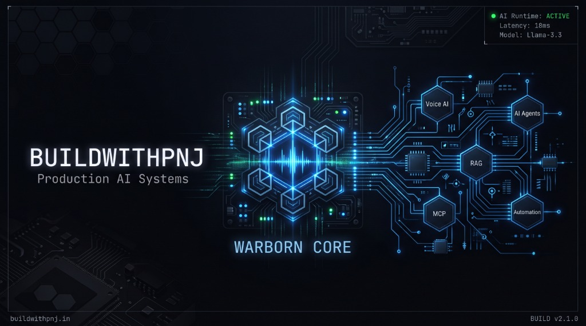
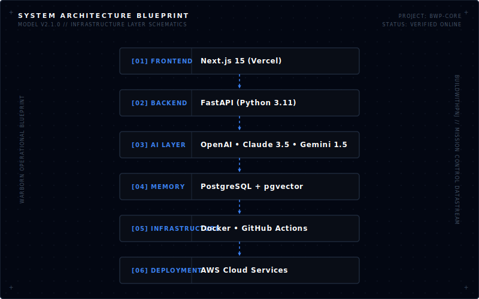

<p align="center">
  
</p>

<h1 align="center">BUILDWITHPNJ</h1>
<p align="center"><strong>Engineering Production AI Systems That Ship.</strong></p>

<p align="center">
  
</p>

Building production-grade AI systems, Voice AI platforms, AI agents, automation infrastructure, and RAG architectures while documenting the complete engineering journey in public.

---

### 📋 Current Sprint

<table width="100%">
  <tr>
    <td width="50%" valign="top">
      <strong>ACTIVE SPRINT</strong>
      <ul>
        <li><code>✓</code> BuildWithPNJ Platform</li>
        <li><code>✓</code> Warborn OS</li>
        <li><code>✓</code> Enterprise Voice AI</li>
        <li><code>✓</code> Multi-Agent Infrastructure</li>
      </ul>
    </td>
    <td width="50%" valign="top">
      <strong>NEXT ACTIONS</strong>
      <ul>
        <li><code>→</code> Evaluation Framework</li>
        <li><code>→</code> Production Deployment</li>
        <li><code>→</code> Enterprise Dashboard</li>
      </ul>
    </td>
  </tr>
</table>

---

### ⚙️ Engineering Philosophy

* **Production over prototypes.** Code that works in a Jupyter Notebook is a liability, not an asset.
* **Architecture before implementation.** Design systems to fail gracefully and scale predictably.
* **Documentation is part of engineering.** Clear explanation of system design is as important as the code itself.
* **AI systems must be observable.** Tracing, logging, and evaluating agentic state is critical for stability.
* **Build software that survives production.** Resiliency, error-recovery, and rate-limit handling by default.
* **Optimize before scaling.** Profile code, select appropriate model contexts, and configure indexing early.
* **Automation over repetition.** Script standard workflows to remove human bottlenecks.

---

### 📐 Architecture Overview

<p align="center">
  
</p>

---

### 📁 Featured Projects

#### 🟢 BuildWithPNJ
*Central mission control and AI engineering lab hub.*
* **Status**: Production (`Active`)
* **Architecture**: Next.js 15, TailwindCSS, FastAPI, AWS
* **Links**: [buildwithpnj.in](https://buildwithpnj.in) • [Repository](https://github.com/buildwithpnj/buildwithpnj)

---

#### 🟢 Warborn OS
*Autonomous AI operating system coordinator for orchestrating complex agent workloads.*
* **Status**: Beta (`Active`)
* **Architecture**: Python, asyncio, Model Context Protocol, pgvector
* **Links**: [Documentation](https://buildwithpnj.in/docs/warborn-os) • [Repository](https://github.com/buildwithpnj/warborn-os)

---

#### 🟢 Voice AI Platform
*Low-latency enterprise voice agent orchestrator utilizing WebSocket streaming.*
* **Status**: Production (`Active`)
* **Architecture**: WebRTC, VAD, FastAPI, Llama-3.3-70B-Instruct
* **Links**: [Documentation](https://buildwithpnj.in/docs/voice-ai) • [Repository](https://github.com/buildwithpnj/voice-ai)

---

#### 🟢 AI Agent Runtime
*Production-ready multi-agent runtime backing stateful agent operations and tool access.*
* **Status**: Alpha (`Building`)
* **Architecture**: LangGraph, FastAPI, Redis, Docker
* **Links**: [Documentation](https://buildwithpnj.in/docs/agent-runtime) • [Repository](https://github.com/buildwithpnj/agent-runtime)

---

#### 🟢 Automation Framework
*Event-driven microservice system automating complex developer operations.*
* **Status**: Stable (`Active`)
* **Architecture**: GitHub Webhooks, Node.js, Docker, AWS Lambda
* **Links**: [Documentation](https://buildwithpnj.in/docs/automation) • [Repository](https://github.com/buildwithpnj/automation-framework)

---

#### 🟢 RAG Platform
*Enterprise-grade retrieval-augmented generation engine with hybrid search and reranking.*
* **Status**: Production (`Active`)
* **Architecture**: Next.js 15, Qdrant, PostgreSQL, pgvector, Claude-3.5-Sonnet
* **Links**: [Documentation](https://buildwithpnj.in/docs/rag-platform) • [Repository](https://github.com/buildwithpnj/rag-platform)

---

### 🔬 Current Tech Focus

```
[ Voice AI ]          [ AI Agents ]          [ Model Context Protocol ]
[ System Evaluation ] [ Advanced RAG ]       [ Event-Driven Automation ]
[ Context Engineering ] [ AI Infrastructure ]  [ State Machine Orchestration ]
```

---

### 📝 Engineering Journal

<!-- JOURNAL:START -->
- **[Why I'm Building AI in Public (And Why This Time Is Different)](https://dev.to/buildwithpnj/why-im-building-ai-in-public-and-why-this-time-is-different-91n)** — *Jul 03, 2026*
<!-- JOURNAL:END -->

---

### ⚡ Recent Activity

<!-- ACTIVITY:START -->
● Pushed changes to `bwp` (`main`) (Jul 13, 2026)
● Pushed changes to `bwp` (`main`) (Jul 13, 2026)
● Pushed changes to `bwp` (`main`) (Jul 13, 2026)
● Pushed changes to `bwp` (`main`) (Jul 13, 2026)
● Pushed changes to `bwp` (`main`) (Jul 13, 2026)
<!-- ACTIVITY:END -->

---

### 🗺️ Project Roadmap

<table width="100%">
  <tr>
    <td width="33%" valign="top">
      <strong>COMPLETED</strong>
      <ul>
        <li><code>✓</code> BuildWithPNJ Website</li>
        <li><code>✓</code> Design System</li>
        <li><code>✓</code> Documentation Portal</li>
        <li><code>✓</code> Mission Control</li>
      </ul>
    </td>
    <td width="33%" valign="top">
      <strong>IN PROGRESS</strong>
      <ul>
        <li><code>●</code> AI Platform Core</li>
        <li><code>●</code> Voice AI Engine</li>
        <li><code>●</code> GitHub Profile V2</li>
      </ul>
    </td>
    <td width="33%" valign="top">
      <strong>UPCOMING</strong>
      <ul>
        <li><code>○</code> AI Factory Pipeline</li>
        <li><code>○</code> Enterprise Dashboard</li>
        <li><code>○</code> AI Operating System</li>
      </ul>
    </td>
  </tr>
</table>

---

### 📊 GitHub Metrics

<p align="center">
  
  
</p>

---

<p align="center">
  <a href="https://buildwithpnj.in">Website</a> • 
  <a href="https://github.com/buildwithpnj">GitHub</a> • 
  <a href="https://www.linkedin.com/in/buildwithpnj/">LinkedIn</a> • 
  <a href="https://www.youtube.com/@buildwithPNJ">YouTube</a> • 
  <a href="https://dev.to/buildwithpnj">Dev.to</a> • 
  <a href="https://www.instagram.com/buildwithpnj/">Instagram</a>
</p>

<hr/>
<p align="center">
  <font size="1" color="#475569">
    © 2026 BuildWithPNJ // AUTOMATED ENGINEERING SYSTEMS // ALL RIGHTS RESERVED
  </font>
</p>
